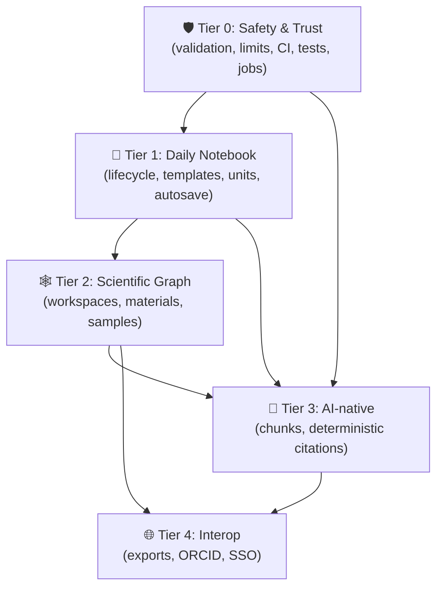

# 🧬 ChemMemo — Product Evolution Implementation Plan

Hub: [[ChemMemo]] · Prior audit + sprints: [[ChemMemo_Audit_Roadmap]] · Build log: [[ChemMemo_Implementation_Plan]] · Vision: [[ChemMemo_Characterization]] · Recent feature: [[ChemMemo_Feature_ProjectManagement_Spec]]
**Domain standard (Tier 1+):** [[ChemMemo_MFP_Lab_Notebook_Standard]] · **Item-by-item mapping:** [[ChemMemo_Standard_to_Plan_Crosswalk]]

> [!abstract] What this document is
> A **priority-ordered, agent-executable** implementation plan derived from the external *Comprehensive Product, UX, AI, and Engineering Audit* (2026-07-21). The source audit is a strategy document; this file turns it into concrete, sequenced work items with acceptance criteria, file paths, dependencies, and guardrails — written so an implementing agent (Sonnet 5) can pick up **one item at a time** and ship it without mistakes.
>
> **Repo:** `C:\dev\chememo_webapp` · **Implement on `dev`, promote via `dev`→`master`.**

> [!danger] Read this before writing any code — scope reality
> This audit describes evolving ChemMemo from an **AI-enabled experiment registry** into a **full electronic lab notebook (ELN)**. That is a **multi-month, multi-module effort** that roughly 10×'s the app's data model and surface area. It is **NOT** a single sprint.
>
> **Do not attempt to implement more than one work item per change/PR.** Do not start a Tier before its dependencies are shipped and verified. The single most valuable, genuinely-urgent tier is **[[#🛡️ Tier 0 — Production safety & trust|Tier 0]]** (hardening the live app) — everything below Tier 0 is a deliberate product-direction decision the user (Yishi) should green-light tier-by-tier, not a mechanical to-do list to grind through.

---

## 0. How the implementing agent must work (guardrails)

> [!warning] These rules exist to prevent the specific mistakes that are easy to make in THIS codebase. Follow every one.

1. **One work item at a time.** Each item below is scoped to a single reviewable change. Finish, verify, and update the vault before starting the next. Never batch items or tiers.
2. **Brainstorm before big items.** Any item tagged `⚠ spec-first` (workspaces, data-model rewrites, protocols, materials/samples) MUST go through the `brainstorming` skill → a `ChemMemo_Feature_*_Spec.md` in this vault → approval, **before** code. Small hardening items (Tier 0) can go straight to implementation.
3. **Every DB change is a migration.** Filename `supabase/migrations/YYYYMMDDHHMMSS_description.sql`. Make it idempotent (`if not exists`, `drop policy if exists`) where possible.
4. **Apply migrations to `dev` first, via raw SQL, then reload PostgREST.** `dev`'s migration-history table does **not** line up with local filenames (a pre-existing mismatch from earlier MCP-applied migrations), so `supabase db push` fails. Use `supabase db query --linked -f <file>` after `supabase link --project-ref khkpqnpmhravdpbogqai`, then **always** run `supabase db query --linked "notify pgrst, 'reload schema';"` — forgetting the reload means `select *` won't see new columns and checks silently fail. Prod ref: `iazuubcyxneavrahjgww`.
5. **Never deploy straight to prod.** Merge `dev`→`master`; Railway auto-deploys per branch. ⚠️ **Railway gotcha:** `railway service source connect` is NOT environment-scoped despite the `--environment` flag — it resets a shared branch link for the whole service and has twice cross-contaminated dev/prod. Do not use it. If dev needs a manual deploy, use `railway up --detach` (bypasses the shared GitHub link). Verify env→branch mappings in the Railway dashboard.
   - ⚠️ **New (2026-07-23):** the GitHub→Railway auto-deploy webhook silently failed to fire for two consecutive pushes to `dev` (11+ min, no build triggered, no error surfaced anywhere). Don't just wait indefinitely — after ~2-3 min with no new build in `railway status --environment dev --json` (check `latestDeployment.meta.commitHash`), fall back to `railway up --detach --environment dev --service chememo_webapp` rather than assuming the push will eventually land.
   - ⚠️ **New (2026-07-23):** any dependency change (even adding one real package like `zod`) can leave `package-lock.json` inconsistent for `npm ci` in ways a local Windows `npm install`/`npm ci` won't catch — optional platform-specific transitive deps (`@emnapi/*` under wasm32-wasi variants of Tailwind's oxide engine) only get fully validated when the *exact* npm version Railway uses (currently 10.9.8) runs `ci`. Before pushing a dependency change: `rm -rf node_modules package-lock.json && npm install`, then verify with `npx -y -p npm@10.9.8 -- npm ci` (matches Railway's npm), not just your local npm's `ci`. See [[chememo-railway-npm-ci-lockfile]].
6. **Preserve existing invariants.** Keyless fallback must keep working (`isLlmEnabled()` / `isEmbeddingEnabled()` guards). Keep server-only boundaries (`import "server-only"`). Privileged writes go through `createAdminClient()` (service role), never the client. RLS-first: enforce authorization in the database, not just React.
7. **Match existing patterns.** User-facing server actions return `ActionResult` (`{ ok: true } | { ok: false; error }`) and the client toasts via `useToast()`. Don't introduce new state libraries, CSS systems, or dependencies without a reason logged in the item.
8. **Verify every item:** `npm run build` green **and** a manual browser smoke test on the dev URL (https://chememowebapp-dev.up.railway.app). After the Tier 0 test baseline exists, every later item also ships with tests.
9. **Respect the Karpathy/RTK house rules** (from global `CLAUDE.md`): simplicity first, surgical changes, no speculative abstractions, every changed line traces to the item. This plan *adds* a lot overall, but each item stays minimal for its own scope.
10. **AI proposes, the scientist decides.** Never let AI silently write or overwrite scientific values. Never let a completed/locked record be edited silently. Treat experiment notes and uploaded files as untrusted data, not instructions.
11. **Update the vault after each item.** Tick the checkbox here, and log it in [[ChemMemo_Implementation_Plan]] session history (the existing convention). Keep [[ChemMemo]] `next_action` current.
12. **From Tier 1 on, read the domain standard before designing the item.** [[ChemMemo_MFP_Lab_Notebook_Standard]] is the MFP lab's own record-keeping standard and is the authority on **what fields a scientific record must contain**; this plan is the authority on **what we build and when**. [[ChemMemo_Standard_to_Plan_Crosswalk]] maps every Tier 1+ item to the standard sections that govern it, and lists the gaps and conflicts between the two documents. Every `⚠ spec-first` spec from Tier 1 on must include a short **"Standard coverage"** table: which required fields the item implements, defers, or declines, and why. Tier 0 predates the standard and is unaffected.

> [!info] Already shipped — do NOT re-implement (verify current code first)
> The prior internal audit + sprints already delivered much of what the source audit's early sections describe. Confirm against the code before building:
> - Streaming Ask (`POST /api/ask`), revision snapshots (`experiment_revisions`), CSV **export**, toasts, `error.tsx`/`loading.tsx`, embedding auto-sync (fire-and-forget), atomic `EXP-###` sequence, mobile nav, global search, dynamic sidebar project filters, retrieval eval (`npm run eval:retrieval`), user-managed projects ([[ChemMemo_Feature_ProjectManagement_Spec]]).
> - **Partially done this session:** the Ask streaming fetch now has a `30s AbortSignal.timeout` and the client shows a failure message — this is a *down payment* on audit item 17.2 (rate limits/quotas/cost telemetry still missing) and does not close it.
> - The audit wants several of these **deepened** (revision *diffs/restore*, CSV *import*, eval *expanded*, embeddings *chunked + durable*), not created from scratch. Read the "why" in each item.

---

## 1. Priority tiers at a glance

> [!note] Ordering principle
> Ordered **most-important → least-important for the app's health and the user's stated goal** (a tool the lab uses daily), which is the audit's own Phase 0→4 sequence with the urgency made explicit. Tier 0 protects what's already live. Tiers 1–4 are strategic evolution — each is a **decision gate**, not an automatic next step.

| Tier | Theme | Audit phase | Gate | Rough size |
|---|---|---|---|---|
| **[[#🛡️ Tier 0 — Production safety & trust\|Tier 0]]** | Harden the live app | Phase 0 | **Do now** | 1–2 weeks |
| **[[#📓 Tier 1 — Make it a daily lab notebook\|Tier 1]]** | Lifecycle, templates, units, autosave, server search | Phase 1 | User go-ahead | 3–6 weeks |
| **[[#🕸️ Tier 2 — Connected scientific graph\|Tier 2]]** | Workspaces, materials, samples, analyses | Phase 2 | User go-ahead + specs | 6–12 weeks |
| **[[#🤖 Tier 3 — AI-native differentiation\|Tier 3]]** | Chunked index, deterministic citations, comparison | Phase 3 | After Tier 1–2 structure exists | multi-week |
| **[[#🌐 Tier 4 — Interoperability & institutional\|Tier 4]]** | Exports, ORCID, SSO, publishing | Phase 4 | Only if institutional need arises | multi-week |

### Dependency map

> [!tip] Why the arrows matter
> **Tier 0 unblocks everything** — durable jobs, validation, tests, and workspace-ready RLS thinking underpin the rest. **Tier 3 (AI) depends on Tier 1–2 structure** — deterministic citations and comparison are only worth building once there is normalized data to cite and compare. Building AI features on the current flat model first is wasted effort (the audit's §5 & §24 core thesis).

---

## 🛡️ Tier 0 — Production safety & trust

> [!success] Gate: **DO THIS NOW.** No spec needed for these — they are hardening, not new product surface. Ship in roughly the order listed; T0.1–T0.3 and T0.6 are the highest-value.

### T0.1 — Shared Zod validation for all server-action inputs `P0`
- [x] **T0.1 shipped** (2026-07-23, dev only — not yet promoted to master)
- **Why:** `parseForm` in `app/(app)/new/actions.ts` silently coerces invalid numbers to `null` (audit 17.8) and `createExperiment` returns early on empty name with no user feedback (prior audit §3). No shared client/server schema exists.
- **Do:** add `zod` (first real new dep — log it). Create `lib/schemas.ts` with an `experimentInput` schema (pH range + qualifiers, non-negative cycles/quantities, dates, allowed methods, m/z, URL scheme, text length). Validate in the server action; return field-level errors via `ActionResult` (extend it to optionally carry `fieldErrors`). Wire client forms to surface them. Never convert invalid input to `null` silently — preserve the user's input and show the error.
- **Files:** `lib/schemas.ts` (new), `lib/types.ts` (`ActionResult` extension), `app/(app)/new/actions.ts`, `components/experiment-form.tsx`, `app/(app)/projects-actions.ts`.
- **Acceptance:** client and server share one schema; invalid pH/cycles/date/method/URL returns a specific field error; empty name shows an error instead of a silent no-op; no valid input is lost on error.
- **Maps to:** audit §9.4, §17.8, GitHub issue #1.

### T0.2 — Server-side file & URL hardening `P0`
- [x] **T0.2 shipped** (2026-07-23, dev only — not yet promoted to master)
- **Why:** `uploadFile` displays a size limit but doesn't enforce it server-side (audit 17.5); `addFileLink` accepts any URL scheme (`javascript:`/`data:` XSS risk — audit 17.6, also open in [[ChemMemo_Audit_Roadmap]] §3). File rows lack MIME/size/checksum/uploader metadata.
- **Do:** in `file-actions.ts`, enforce max size + allowed MIME/extension allowlist **before** the storage upload; validate links with `new URL()` and an `https:`-only allowlist (reject credentials/unsafe schemes). Store `mime_type`, `byte_size`, `sha256`, `uploaded_by` on the `experiment_files` row (migration to add columns). Keep the existing storage-rollback-on-row-failure behavior; verify authorization before storage deletion (audit 17.16).
- **Files:** `supabase/migrations/*_file_metadata.sql` (new), `app/(app)/experiments/[id]/file-actions.ts`, `lib/types.ts` (`ExperimentFile`).
- **Acceptance:** oversized/disallowed uploads rejected server-side with a friendly error; only `https:` links accepted; metadata persisted; no orphaned storage object or row on partial failure; delete verifies permission first.
- **Maps to:** audit §13.1, §13.2, §17.5, §17.6, §17.16, GitHub issue #2.

### T0.3 — AI endpoint limits & telemetry `P0`
- [x] **T0.3 shipped** (2026-07-23, dev only — not yet promoted to master)
- **Why:** `POST /api/ask` authenticates but has no rate limit, body/length cap, concurrency cap, or cost logging (audit 17.2). The `AbortSignal.timeout(30s)` added this session is only the provider-timeout piece.
- **Do:** add per-user (and, once workspaces exist, per-workspace) rate limiting; cap query length + request body size; cap concurrent streams; keep the abort timeout. Add an `ai_requests` table logging latency, retrieved-source count, model, mode, response status, and a token/cost estimate (avoid storing sensitive prompt text). Surface a friendly retryable error (the client already handles `failed`).
- **Files:** `app/api/ask/route.ts`, `app/(app)/ask/actions.ts`, `app/(app)/experiments/[id]/summary-actions.ts`, `lib/llm.ts`, `supabase/migrations/*_ai_requests.sql` (new), a small `lib/rate-limit.ts`.
- **Acceptance:** requests over the length/frequency cap get a clear error; concurrent-stream cap enforced; each AI call logs a row; no secret prompt text stored; keyless path unaffected.
- **Maps to:** audit §12.9, §15.1, §17.2, GitHub issue #3.

> [!tip] T0.3 tunable limits (all in `lib/rate-limit.ts` unless noted — adjust here, then in code)
> | Limit | Value | Where |
> |---|---|---|
> | Requests per user per minute | **12** | `lib/rate-limit.ts` → `MAX_PER_WINDOW` (window = `WINDOW_MS` = 60s) |
> | Concurrent AI calls per user | **1** | `lib/rate-limit.ts` → `acquireConcurrency` (Set-membership check) |
> | Concurrent AI calls, global | **5** | `lib/rate-limit.ts` → `MAX_CONCURRENT_GLOBAL` |
> | Max question length | **2000 chars** | `lib/rate-limit.ts` → `MAX_QUERY_CHARS`, enforced in `app/api/ask/route.ts` |
> | Max `/api/ask` request body | **8 KB** | `lib/rate-limit.ts` → `MAX_BODY_BYTES`, enforced in `app/api/ask/route.ts` |
> | Provider stream timeout (pre-existing) | **30s** | `lib/llm.ts` → `chatStream`'s `AbortSignal.timeout(30_000)` |
>
> Rate limiter is **in-memory, single-process** (Railway runs one instance) — if the service ever scales to multiple instances, this stops coordinating across them and needs a shared store (Redis) instead. Shared budget across Ask + both summary endpoints (not partitioned per feature). Rate-limited *attempts* are not logged to `ai_requests` (no provider call was made) — only actual calls (ok/error).

### T0.4 — Strict lab-only Ask mode (provenance) `P0`
- [x] **T0.4 shipped** (2026-07-23, dev only — not yet promoted to master)
- **Why:** when retrieval returns nothing, the same endpoint streams a **general-knowledge** answer that can look like a lab conclusion (audit 17.3, 12.1). Provenance risk.
- **Do:** add an explicit mode toggle — **"Search my lab"** (default; never falls back to general knowledge — says "no matching experiments" instead) vs **"Scientific context"** (general knowledge, visually separated, clearly labelled "not from your lab"). Persist mode in the URL/history + `ai_requests`.
- **Files:** `app/api/ask/route.ts`, `lib/rag.ts`, `lib/llm.ts` (`streamGeneralAnswer` gated behind explicit mode), `components/ask-client.tsx`.
- **Acceptance:** lab mode never emits a general answer; insufficient evidence is explicit; context mode is visibly distinct; mode is tracked.
- **Maps to:** audit §12.1, §17.3, GitHub issue #4.

### T0.5 — Durable indexing job queue (replace fire-and-forget) `P0` ⚠ spec-first (small)
- [x] **T0.5 shipped** (2026-07-25, dev only — not yet promoted to master). Design: [[ChemMemo_Feature_IndexJobs_Spec]].
- **Why:** `lib/sync-embedding.ts` is wired fire-and-forget from `new/actions.ts`; an unawaited embed call can be lost on a deploy/restart, leaving records unindexed and silently absent from semantic search (audit 17.1, 12.6).
- **Do:** transactional outbox. On create/update/delete, insert an `index_jobs` row **in the same transaction** as the experiment write. A worker claims jobs with retries/backoff, records failure detail, and exposes status. On Railway (no separate worker process by default), a pragmatic first version is a Supabase `pg_cron` job or a protected internal route triggered on a schedule — **brainstorm the worker mechanism first** (short spec) since Railway's single-service model constrains options. Show index status in a small admin/health view (folds into T0.10).
- **Files:** `supabase/migrations/*_index_jobs.sql` (new), `lib/sync-embedding.ts` (enqueue instead of call), `new/actions.ts`, new worker route/cron.
- **Acceptance:** create/update/delete enqueues a job; failures retry and are visible; a reindex-by-model/version path exists; no lost indexing across a deploy.
- **Maps to:** audit §12.6, §17.1, GitHub issue #5.

### T0.6 — Test + CI baseline `P0`
- [x] **T0.6 shipped** (2026-07-25/26, dev only — not yet promoted to master/prod as app code, but CI/branch-protection now live on the real GitHub repo). Vitest unit tests (`lib/schemas.ts`, `lib/search.ts`) + component tests (`ToastProvider`/`useToast`, Testing Library + jsdom), Playwright E2E (7 tests: unauthenticated redirect, login form, sign in/out, create+delete experiment, global search) + axe accessibility checks (login + experiments list), Supabase RLS integration tests (`tests/rls/experiments.rls.test.ts` — proves anonymous reads are blocked, any authenticated user can read lab-shared data, only the owner can write/delete/insert-as-self), a `.github/workflows/ci.yml` with two jobs (`ci`: install→typecheck→lint→unit+component→build→Playwright+axe→dependency-audit(non-blocking)→gitleaks; `rls`: Docker+Supabase CLI, `supabase start` doubling as migration validation), and branch protection on `master` requiring both `ci` and `rls` to pass (no PR review required, force-push/delete disabled) are all done and **confirmed fully green in GitHub Actions** (commit `788f0f8`). A dedicated `e2e-test@chememo.local` Supabase account exists on dev (`scripts/create-e2e-user.ts`) for the E2E suite. Along the way: fixed a real WCAG 4.1.2 violation axe caught (`aria-label` on a role-less loading `
`); fixed 3 pre-existing lint issues that were blocking the whole pipeline (React's "adjust state during render" pattern replacing `setState`-in-`useEffect`); discovered and fixed that a bare `supabase start` doesn't replicate the hosted project's default table GRANTs (CI-local-instance-only fix, doesn't touch real migrations). **Narrower than the "Do" line's full E2E flow list** (edit/clone/complete experiment, upload/remove file, Ask AI flows, project create/delete permissions, revision display, mobile nav aren't covered yet) — but all of T0.6's stated **acceptance criteria** are met, so the infrastructure itself is the complete, foundational deliverable; expanding E2E coverage incrementally is normal ongoing work, not a blocker for "shipped." **Practical consequence of branch protection:** future `dev`→`master` promotions likely need to go through a GitHub PR (even without a required review) so CI can report success on that commit before merge — a raw direct `git push origin master` will likely be rejected now.
- **Why:** only `build`, `lint`, `eval:retrieval` exist — no unit/component/integration/E2E/RLS tests (audit 17.10, §16.1). Everything below is riskier without this, so build it early.
- **Do:** add **Vitest** (unit) + **Testing Library** (component) + **Playwright** (E2E) + **Supabase local RLS integration tests** with ≥2 users + **axe** accessibility checks. Seed critical E2E flows: sign in/out, create/edit/clone/complete experiment, upload/remove file, search/filter, Ask (grounded/no-answer/general), project create/delete permissions, revision display, mobile nav. Add a GitHub Actions CI running install (lockfile) → typecheck → lint → unit → build → migration validation → RLS tests → Playwright smoke → dependency audit → secret scan. Protect `master`, require checks.
- **Files:** `vitest.config.ts`, `playwright.config.ts`, `.github/workflows/ci.yml`, `tests/**`, `package.json` scripts.
- **Acceptance:** `npm test` runs unit+component; Playwright smoke passes on a local/preview build; RLS tests prove non-member/viewer isolation; CI required before merge.
- **Maps to:** audit §16.1, §16.2, §17.10, GitHub issue #15. **Note:** RLS isolation tests here are also the harness for [[#T2.1 — Workspace & role model|T2.1]].

### T0.7 — Generate DB types from Supabase schema `P1`
- [x] **T0.7 shipped** (2026-07-26, dev only — not yet promoted to master)
- **Why:** handwritten types in `lib/types.ts` drift from migrations (audit §16.3). This session already hit one drift (adding `owner_id` by hand).
- **Do:** add `supabase gen types typescript` to a script; commit generated types; use them in data-access queries. Keep small hand-authored view/DTO types where helpful, but source table shapes from generated types.
- **Acceptance:** a `types:gen` script exists; queries use generated row types; a schema change surfaces as a type error until regenerated.
- **Maps to:** audit §16.3.

### T0.8 — Domain service layer + typed error model `P1`
- [x] **T0.8 shipped** (2026-07-26, dev only — not yet promoted to master)
- **Why:** business logic lives directly in server actions; there's no typed error taxonomy (audit §16.4, §16.5). This is refactor-for-leverage before Tier 1 piles on more logic.
- **Do:** extract `lib/experiments/service.ts`, `lib/files/service.ts`, `lib/projects/service.ts`, `lib/search/service.ts`, `lib/ai/service.ts`, `lib/authorization/policies.ts`. Server actions become thin: authenticate → validate (T0.1) → call service → map to `ActionResult`. Add a typed error union (validation, permission-denied, not-found, conflict, rate-limited, provider-unavailable, index-pending) mapped to user-safe messages + a logged trace ID. **Surgical:** move logic, don't rewrite behavior; tests (T0.6) must stay green.
- **Acceptance:** actions delegate to services; typed errors map to friendly messages + trace IDs; behavior unchanged (tests prove it).
- **Maps to:** audit §16.4, §16.5.

### T0.9 — Observability: error monitoring + structured logs `P1`
- [x] **T0.9 shipped** (2026-07-26, dev only — not yet promoted to master)
- **Why:** no error monitoring, structured logs, or health metrics (audit §16.6, §15.1).
- **Do:** add Sentry (or equivalent) for error monitoring; structured application logs with trace IDs (from T0.8); `/api/health` + an index-health signal; sanitize logs so no secrets/keys/prompt text leak. Add DB/storage capacity + AI provider latency/error metrics where cheap.
- **Acceptance:** unhandled errors reach the monitor with a trace ID; health endpoint returns readiness; logs contain no secrets.
- **Maps to:** audit §15.1, §16.6.

### T0.10 — Production health & index-health screen `P1`
- [x] **T0.10 shipped and live-verified on dev (2026-07-28)** — network block from 2026-07-27 resolved; live browser click-through of `/health` confirmed OK status, 0 pending/failed jobs, 0% AI error rate. **Live verification caught three real bugs in the already-shipped health-metrics code**, fixed same session: (1) `getIndexVersionStatus`'s "latest done job" pick had no filter for an actual recorded model, so a soft-deleted experiment's job (marked `done` without ever setting `embedding_model`/`embedding_dimensions`) could win and show blank "Model: — · Dimensions: —"; (2) `indexedCount` counted `index_jobs` rows regardless of whether their experiment was later soft-deleted, so it could exceed `totalExperiments` (showed "19/14"); (3) deeper issue found while fixing #2: `index_jobs` only tracks experiments that passed through the T0.5 job queue (added 2026-07-25) — the 13 pre-existing seed experiments never edited since then have real embeddings but no job row at all, so even the corrected `index_jobs`-sourced count read "1/14" when actual coverage was 14/14. Switched `indexedCount` to query `experiment_embeddings` directly (the real coverage signal) instead of `index_jobs`. All three fixes verified live: reloaded `/health` after each deploy, confirmed `Model: gemini-embedding-001 · Dimensions: 1536` and `14/14 experiments indexed` matching ground truth (cross-checked via direct SQL). Commits `614a13e`, `0db6c1d`. Backup-restore-test remains **known, tracked debt** (blocked on a Supabase paid-plan upgrade, not fixed here — an explicit prior user decision, not an oversight). Not yet promoted to master.
- **Why:** operational readiness lacks evidence (audit §2.1, §12.5); index status from T0.5 needs a home.
- **Do:** a minimal admin-only screen: indexing queue depth/failures, embedding index version/status, recent AI errors, backup-restore-test status (manual entry ok initially). Confirm/document the production migration + **backup restoration test** (audit Phase 0 line 1 — the one un-evidenced production-safety item).
- **Acceptance:** an authorized user can see index/queue/AI health; a backup restore test has been run and recorded.
- **Maps to:** audit §12.5, §15.1 (#9), §19 Phase 0.

### T0.11 — Protect seed/reference project deletion `P2`
- [x] **T0.11 shipped** (2026-07-28, dev only — not yet promoted to master)
- **Why:** [[ChemMemo_Feature_ProjectManagement_Spec]] intentionally let *any* member delete ownerless projects to clean up the 4 seeds. That cleanup was done on **prod** (0 seed rows), but **dev still had all 4** (`wet-dry`, `depsi`, `lcms`, `micro`, still referenced by EXP-001..013) — discovered as part of this item's precondition check.
- **Do:** tightened `projects_delete_own` to owner-only (dropped the `or owner_id is null` clause). Per Yishi's decision, backfilled the 4 dev seed projects' `owner_id` to `yishieze@gmail.com` (`cd102d14-5624-49e6-9e1f-ab5c7a2d8022`) in the same migration first, so tightening the policy didn't strand them ownerless.
- **Files:** `supabase/migrations/20260728120000_tighten_project_delete.sql` (backfill + policy), `components/sidebar-nav.tsx:131` (`canDelete = p.owner_id === currentUserId`).
- **Acceptance:** ✅ verified via direct RLS test (not just UI): created a disposable project owned by a second real user, confirmed that user could delete their own project (200, row removed) and could **not** delete `wet-dry` owned by another user (200, 0 rows affected, row unchanged). No ownerless projects remain (`select * from projects where owner_id is null` → 0 rows on dev).
- **Maps to:** audit §15.3, §17.15. Depends on: seed cleanup (done 2026-07-21 on prod; dev cleanup folded into this item 2026-07-28).

---

## 📓 Tier 1 — Make it a daily lab notebook

> [!question] Gate: needs Yishi's go-ahead. This is where ChemMemo stops being a registry and becomes a notebook. Highest product ROI after Tier 0. Several items are `⚠ spec-first`.

> [!warning] Migration discipline for Tier 1+
> From here the schema changes get real. Every item: brainstorm → spec in-vault → migration on dev (raw SQL + `notify pgrst`) → build+smoke+tests → dev verify → `dev`→`master`. Existing text/array fields stay as **legacy/display** during migrations — never destructively drop scientific data.

> [!abstract] Read the domain standard first (added 2026-07-28)
> Tier 1 is where ChemMemo starts storing *scientific record structure*, so from here on [[ChemMemo_MFP_Lab_Notebook_Standard]] governs the field-level design of every item. Per item, open its row in [[ChemMemo_Standard_to_Plan_Crosswalk]] §2 **before** writing the spec — the crosswalk names the exact standard sections and what they require.
>
> The five blocking conflicts were **decided by Yishi on 2026-07-29** and are now requirements on the items below. Full reasoning in [[ChemMemo_Standard_to_Plan_Crosswalk#7. Decisions — C1-C5 resolved 2026-07-29]]:
> - **C1** — T1.1 ships the **experiment lifecycle only**, but the enum gains `failed` and `cancelled`, and the type is named `experiment_status`. Task status → T1.9, sample status → T2.3, analysis status → T2.5.
> - **C2** — §8.1's 18 planning sections split three ways: 7 narrative ones become T1.1 columns (with `objective` renamed **`scientific_question`**), entity-referencing ones become T1.2 template sections, and acceptance criteria ships in T1.1 with its own lock.
> - **C3** — **Batch is now in the object model.** A `batches` table lands in T2.3 with an implicit `B1` auto-created per experiment; samples FK to a batch. **T1.1 must reserve the batch segment in the ID scheme.**
> - **C4** — T1.4 pins a canonical unit per quantity kind and seeds named quantity kinds finer-grained than "concentration"; it owns the export mapping, not T4.1.
> - **C5** — a read-only single-record Markdown export splits out as new **[[#T1.11 — Single-record Obsidian Markdown export (read-only)|T1.11]]**; T4.1 keeps packages and import.
>
> The crosswalk also lists **12 standard requirements with no plan item** (deviations as an entity, quality flags, an append-only bench execution log, legacy-alias preservation, chain of custody, and more). **G8 is now closed** by C2, and **G11 by the 2026-07-29 seed-table decision** (all six §23 vocabularies registered in T1.1; columns land with T2.2/T2.3/T2.5). The remaining ten are **proposals only** — they do not enter this plan without Yishi's explicit go-ahead, one item at a time, per guardrail 1.

### T1.1 — Experiment lifecycle & completion `P0-for-tier` ⚠ spec-first
- [x] **T1.1 shipped** — live in production 2026-07-29. Migration applied to both `chememo-dev` and prod (`chememo`); full rollout (implement → dev migration/smoke test → merge to master → prod migration/deploy) completed same session, alongside promoting the previously-unshipped Tier 0 (11/11 items) to master too. Five real bugs found and fixed via CI re-runs against a real fresh Postgres and the real dev Supabase project before promotion — see [[ChemMemo_Implementation_Plan#Session history]] for the full account.
- **Spec:** [[ChemMemo_Feature_ExperimentLifecycle_Spec]] (written 2026-07-29, implemented and shipped 2026-07-29). Satisfies the `⚠ spec-first` gate. Includes the required Standard-coverage table and two open questions for Yishi that do not block implementation (both resolved as D11/D12 in the spec).
- **Why:** experiments have no status; completed records can be silently edited (audit §7.3, §14.4, #6).
- **Standard:** [[ChemMemo_MFP_Lab_Notebook_Standard]] §3.2 (planned/actual are separate **pairs**), §3.5 (7 required timestamps, ISO + timezone), §8.1 (18 planning sections), §8.6 (acceptance criteria locked before analysis), §10.3 + §23.3 + §23.4 (three *other* status vocabularies), §15.2–§15.3 (conclusion scope + language), §18.5 (reason required to edit a completed record). Conflicts **C1, C2, G6, G8** apply — see [[ChemMemo_Standard_to_Plan_Crosswalk#T1.1 — Experiment lifecycle & completion]].
- **Do:** add `experiment_status` enum — `draft/planned/in_progress/paused/completed/reviewed/archived/failed/cancelled` (**`failed` and `cancelled` added per C1**; the type is namespaced, never a bare `status`). Add `started_at`/`completed_at`/`reviewed_at`, `completed_by`/`reviewed_by`, `locked_at`. Narrative fields are the **7 genuinely narrative §8.1 sections per C2**: `scientific_question` (was `objective`), `rationale`, `hypothesis`, `primary_outcome`, `secondary_outcomes`, `data_analysis_plan`, `risks_failure_modes` — plus `conclusion` and `next_steps`. Add `acceptance_criteria` + `acceptance_criteria_locked_at` (§8.6, closes gap **G8**) reusing the completion-lock machinery. **Reserve the batch segment in the identifier scheme per C3** (§6.2 `E014-B1-LacPro-R1`) even though `batches` lands in T2.3. Completed → record locks against silent edits; reopen/amend requires a documented reason. Add completeness checks on completion. Consistent status color+icon language (never color alone — audit §10.4).
- **Also per G11 (decided 2026-07-29):** add a `controlled_vocabularies` seed table (`vocabulary`, `value`, `sort_order`, `standard_section`, `active`) holding **all six §23 vocabularies** — sample type (§23.1), reaction mode (§23.2), sample status (§23.3), analysis status (§23.4), solubility status (§23.5), result confidence (§23.6). Rows, **not** Postgres `ENUM` types: §25 lets the standard version past 1.0, and as rows a revision is an `UPDATE … SET active = false` instead of a migration, with the historical value still readable on old records (§4). Values only here; the columns that consume them arrive with T2.2, T2.3, T2.5.
- **Spec must also record** the C1 lifecycle-ownership table (task status → T1.9, sample status → T2.3, analysis status → T2.5) so those vocabularies can never be invented as free text later.
- **Acceptance:** status transitions enforced incl. the two terminal-failure states; completed records can't be silently edited; reopen requires a reason; acceptance criteria lock before analysis and can't be edited after; narrative fields on the detail page under their standard names; sample codes minted with a batch slot.
- **Maps to:** audit §7.3, §10.4, §14.4, GitHub issue #6.

### T1.2 — Templates & clone experiment `P0-for-tier` ⚠ spec-first
- [x] **T1.2 shipped** (2026-08-02, dev + prod)
- **Why:** "New experiment" is a blank form; no reuse (audit §9.1, §17 issues #7/#8) — the audit rates this **very high** adoption ROI.
- **Standard:** §20 ships **11 ready-made templates** (project, experiment, batch, sample, stock, protocol, daily log, analysis, deviation, transfer, weekly dashboard) — build the seed library from these, don't invent a parallel set. Also §8.1 (required fields), §8.2 (19 sample-matrix columns), §8.5 (4 control checklists by experiment type), §8.3 + §6.3 (a clone mints fresh IDs and correct replicate labels), §19.4 (`TBD`, never invented examples). See [[ChemMemo_Standard_to_Plan_Crosswalk#T1.2 — Templates & clone experiment]].
- **Per G11:** the §8.2 sample-matrix template column for **sample type must render from the `controlled_vocabularies` table** (§23.1, 11 values), never as free text — §8.5's control checklists and T2.6's "required controls present?" check both depend on it being a real vocabulary.
- **Per C2:** templates carry the **entity-referencing §8.1 sections** T1.1 does not — sample matrix, controls, protocol version, planned analyses, sample-storage plan, independent/controlled variables — as structured text for now, each under its final standard field name. A later tier replaces the *editor*, not the *name*, so the export contract never breaks.
- **Do:** `experiment_templates` (+ versions) defining sections/required fields/default units/expected analyses/control requirements. New-experiment entry menu: *Start from template / Clone an experiment / Continue a series / Blank / Import*. Clone lets the user pick which sections to copy (files/results/history NOT copied by default) and records a relationship to the source (feeds T1.7). Historical runs retain the template *version* they used.
- **Acceptance:** create/edit/version a template; instantiate a new experiment from a version; clone with section selection + recorded source link; new record gets a fresh code+owner.
- **Maps to:** audit §9.1, GitHub issues #7, #8.

### T1.3 — Autosave, draft recovery, conflict detection `P0-for-tier`
- [x] **T1.3 shipped** (2026-08-02 dev, promoted + live in prod 2026-08-04)
- **Why:** the form uses uncontrolled inputs + remount-on-prefill; in-progress work is lost on re-extract or crash (audit §9.3, #9).
- **Standard:** §10.2 (append-only: a correction is a new event, never an overwrite), §3.2 (an "actual" must never bleed into the planned field), §19.1 (the paste-notes flow must preserve the **raw source note** alongside the structured record, plus an explicit "unresolved items" block). See [[ChemMemo_Standard_to_Plan_Crosswalk#T1.3 — Autosave, draft recovery, conflict detection]].
- **Do:** debounced autosave; visible save state (Saving/Saved/Offline/Conflict); local draft cache; browser-crash recovery; conflict detection via record version or `updated_at`; navigation warning only when needed; no duplicate records from retries.
- **Acceptance:** save state always visible; a browser crash recovers the draft; concurrent edits are detected; retries don't duplicate.
- **Maps to:** audit §9.3, GitHub issue #9.

### T1.4 — Structured quantities & units `P0-for-tier` ⚠ spec-first
- [x] **T1.4 shipped** (2026-08-02 dev, promoted + live in prod 2026-08-04)
- **Why:** `temperature`/`concentration` are free text; they can't be compared or plotted (audit §7.5, §17.7, #12). Foundational for analytics and AI reasoning.
- **Standard:** §6.6 (**every ratio carries order and type** — `L-Lac:L-Pro = 5:1 mol/mol`; a bare `5:1` is invalid, and molar ratio is computed from amounts, not typed), §13.2 (**concentration basis lives in the field name**: `starting_AA_concentration_mM`, `LCMS_vial_AA_equivalent_mM`), §9.4 (`temperature_C`, `duration_h`), §7.3 + §19.3 (purity/density/assay corrections, calculations shown), §12.3 (0–4 dissolution/opacity/gel-rigidity scales), §18.5 (warn on missing `w/w` vs `w/v` vs `v/v`, and on missing basis). Conflict **C4** applies. See [[ChemMemo_Standard_to_Plan_Crosswalk#T1.4 — Structured quantities & units]].
- **Do:** store comparable physical values as `{ value, unit_code, normalized_si?, uncertainty?, qualifier? }`. **Per C4:** seed a registry of **named quantity kinds finer-grained than "concentration"** from §9.4/§13.2/§7.3 — `starting_AA_concentration_mM` and `LCMS_vial_AA_equivalent_mM` are *different quantities*, not one quantity in two contexts. **Pin a canonical unit per quantity kind** (the standard encodes it in the field name: `_C`, `_h`, `_mM`), so the unit dropdown is per-kind. Build the versioned `quantity_kind` → standard-field-name mapping **here, not in T4.1**. Curated unit dropdown (UCUM semantics under the hood, small curated list in UI). Support compatible conversions. Keep existing free-text values as legacy/display during migration. Start with temperature, concentration, volume, time.
- **Acceptance:** value+unit stored separately; curated per-kind units with a declared canonical; compatible conversions; the export mapping round-trips `{kind: temperature, value: 80, unit: Cel}` → `temperature_C: 80`; §18.5's missing-basis warning falls out of picking a generic kind; legacy text preserved.
- **Maps to:** audit §7.5, §17.7, GitHub issue #12.

### T1.5 — Versioned protocols & experiment steps `P1-for-tier` ⚠ spec-first (Large)
- [x] **T1.5 shipped** (2026-08-02 dev, promoted + live in prod 2026-08-04)
- **Why:** procedures are free-text notes; no reproducible, versioned steps (audit §7.4, §17 issue #13) — rated **very high**, but **Large**.
- **Standard:** §9.1 (13 protocol fields incl. critical parameters + known failure modes), §9.2 (18 dry-down fields), §9.3 (wet-dry per-cycle table, shared with T2.6), §9.5 (atmosphere/UV/gamma/plasma), §9.6 (**record the order of operations as performed** — "reconstituted in 50:50 water/ACN" is an unacceptable collapse of six ordered steps), §11.1–§11.2 (20 deviation categories, 12 required deviation fields), §10.1 (16 event types), §20.6 (protocol template). See [[ChemMemo_Standard_to_Plan_Crosswalk#T1.5 — Versioned protocols & experiment steps]].
- **Do:** `protocols`, `protocol_versions` (immutable), `protocol_steps`; `experiment_steps` instantiate a version; `step_observations`, `step_deviations`. Each step: instruction, expected duration, target temp/pH/atmosphere, required material/sample, timer, safety note, completion state+timestamp, actual values, deviation reason, attachments. Editing a run must not alter the historical protocol definition.
- **Acceptance:** immutable protocol versions; instantiated steps with completion/actuals/deviations/photos; old runs unchanged when a protocol changes.
- **Maps to:** audit §7.4, GitHub issue #13.

### T1.6 — Server-side experiment search & pagination `P1-for-tier`
- [x] **T1.6 shipped** (2026-08-03 dev, promoted + live in prod 2026-08-04)
- **Why:** the list loads **all** experiments and filters in the browser (audit §11.1, §17.11) — degrades past a few hundred rows.
- **Standard:** §6.1 (search resolves both the immutable machine ID and the human label), §4.1–§4.3 + §16.5 (**legacy codes are search keys**: `B1`, `NMA`, `G5_10mM`, `FC`, `DC`, and legacy analytical filenames), §6.4 (compound aliases, e.g. `GlyAc` also findable as `Glc`), §22.2 (**alias resolution is project-scoped** — `Glc` is glycolic acid in one project and glucose in another), §23 (the six controlled vocabularies are the natural facets). See [[ChemMemo_Standard_to_Plan_Crosswalk#T1.6 — Server-side experiment search & pagination]].
- **Do:** cursor pagination; indexed server filters; Postgres full-text search; numeric/date range filters; faceted counts; URL-backed filter state; saved views. Move `components/experiments-table.tsx` filtering server-side; add indexes matching real filters.
- **Acceptance:** cursor pagination; URL-backed filters incl. ranges; saved views; query plan tested at realistic scale.
- **Maps to:** audit §11.1, §17.11, GitHub issue #10.

### T1.7 — Experiment relationships & series `P1-for-tier`
- [x] **T1.7 shipped** (2026-08-03 dev, promoted + live in prod 2026-08-04)
- **Why:** no parent/child, replicate, control, or series links (audit §7.8, §17 issue #14) — "relationships are first-class data" (§23).
- **Standard:** §5 object model (`Project → Experiment → **Batch** → Sample → Aliquot → Analysis` — **conflict C3: this plan has no batch entity**), §5.3 (batch = an independent preparation of the same plan), §8.4 (**five distinct replicate kinds**; three injections of one vial are *not* triplicate reactions, so a single `replicate_of` is too coarse), §3.6 (lineage, never a shared ID), §8.3 (a failed prep keeps its ID; the replacement links back to it). See [[ChemMemo_Standard_to_Plan_Crosswalk#T1.7 — Experiment relationships & series]].
- **Do:** `experiment_relationships` (source/target/type: replicate_of, control_for, optimization_of, continuation_of, based_on, confirms, contradicts, same_series) shown bidirectionally; first-class `experiment_series`; a series page with quick comparison. Clone (T1.2) auto-records `based_on`.
- **Scope cut from C3:** do **not** add a `batch_repeat_of` relationship type. A repeat preparation of the same plan is a new **batch** (T2.3), not a new experiment — §5.2 says the scientific question has to change before something is a new experiment. §8.4's five replicate kinds still need distinguishing here, but "independent preparation batch" is now the batch entity's job, not a relationship type's.
- **Acceptance:** relationships created + shown both directions; series page compares members.
- **Maps to:** audit §7.8, GitHub issue #14.

### T1.8 — Improved revision diff & restore `P1-for-tier`
- [x] **T1.8 shipped** (2026-08-03 dev, promoted + live in prod 2026-08-04)
- **Why:** `experiment_revisions` snapshots exist (#24) but the UI lacks field-level diffs, restore, and meaningful-change filtering (audit §14.3, §17.12).
- **Standard:** §10.2 (append-only; the original entry is never removed), §18.2 (update creates a traceable revision, delete is soft), §18.5 (immutable original timestamps; restore must not silently write into a locked record), §3.4 (**restore/diff must never become a quiet route to deleting a failed or adverse result**). Note §10.1's human-authored bench log is a *different* thing from these system revisions — see gap **G3**. [[ChemMemo_Standard_to_Plan_Crosswalk#T1.8 — Improved revision diff & restore]].
- **Do:** show editor identity, field-by-field old→new, added/removed list items, restorable revision, reason-for-change where required, file-version + status/signature events. Avoid generating revisions when only `updated_at` changed.
- **Acceptance:** diff view with identities; restore works; no noise revisions.
- **Maps to:** audit §14.3, §17.12.

### T1.9 — Comments, mentions, review requests `P1-for-tier`
- [x] **T1.9 shipped** (2026-08-03 dev, promoted + live in prod 2026-08-04)
- **Why:** no collaboration primitives beyond read-all/edit-own (audit §14.1, §14.2).
- **Standard:** §8.1 item 17 (assigned people and tasks belong *in* the record), §10.3 (`blocked`/`waiting` must name the blocker), §4.4 (collaborator names, task ownership, follow-up questions, and decisions are paper-notebook habits worth keeping), §5 (`Decision` is a first-class object), §20.11 (the weekly dashboard's "decisions needed from Moran or collaborators" is the review-request surface). See [[ChemMemo_Standard_to_Plan_Crosswalk#T1.9 — Comments, mentions, review requests]].
- **Do:** contextual comments on experiment/step/file/result/AI-answer with `@mentions`, resolution state, notifications, deep links. Lightweight tasks (assignee/due/status/linked object/type) + a "Request review" action with a checklist.
- **Acceptance:** comments with mentions+resolution; tasks; review request flow.
- **Maps to:** audit §14.1, §14.2. **Note:** most valuable *after* [[#T2.1 — Workspace & role model|T2.1]] gives real membership; a single-lab version can ship earlier.

### T1.11 — Single-record Obsidian Markdown export (read-only) `P1-for-tier` `Small`
- [x] **T1.11 shipped** (2026-08-04 dev, promoted + live in prod 2026-08-04)
- **Added 2026-07-29** by decision **C5**, splitting the export scope that used to sit entirely in T4.1. Sequence **after T1.1** — it needs the narrative fields and standard field names to exist.
- **Why:** §2.5 and §18.1 list "able to export structured Markdown for Obsidian" as a **core platform property**, not a Tier 4 nicety. Two concrete reasons to have it early: it is the **migration safety net** across Tiers 1-3 of continuous schema churn (the lab is never trapped mid-transition), and it is the cheapest **forcing function** on the C2 and C4 naming decisions — a field with no standard name shows up as a visible hole in the export immediately, rather than at Tier 4 when renaming has become a migration.
- **Standard:** §16.3 (file-naming format), §20.2 (the experiment template is the target shape), §19.5 (writing style in records: clear scientific English, short paragraphs, no em dashes, chemical notation and stereochemistry preserved). Uses the T1.4 `quantity_kind` → standard-field-name mapping (**C4**) so `{kind: temperature, value: 80, unit: Cel}` serializes as `temperature_C: 80`.
- **Do:** one server route that renders a single experiment as Obsidian-flavored Markdown — YAML frontmatter from the structured fields under their standard names, narrative sections in §20.2 order, wikilinks for relationships. Deliberately **out of scope**: import, round-trip, multi-record packages, ZIP, attachments, and fidelity guarantees. All of those stay in T4.1.
- **Acceptance:** a completed experiment exports to Markdown that opens cleanly in Obsidian; every §8.1 field T1.1/T1.2 stores appears under its standard name; fields with no standard name are reported rather than silently dropped.
- **Maps to:** standard §2.5, §18.1; crosswalk gap **G10** (partial), conflict **C5**.
<!-- T1.11 is placed before T1.10 deliberately: it is sequenced right after T1.1, while T1.10 is independent of the schema work. -->

### T1.10 — Accessibility pass to WCAG 2.2 AA `P1-for-tier`
- [x] **T1.10 shipped** (2026-08-04 dev, promoted + live in prod 2026-08-04)
- **Why:** open a11y gaps: table sort headers not keyboard-operable / no `aria-sort`, auth toggle keyboard activation, no live regions for save/upload/AI streaming ([[ChemMemo_Audit_Roadmap]] §1, audit §10.6).
- **Standard:** barely constrains this item — drive it from the audit. Only §2.5 ("clean, practical, scientific, modern, minimally crowded") and §14.5 (raw spreadsheet behind a button; plots, plate map, and conclusions in front) speak to it, and both are density/hierarchy rather than a11y.
- **Do:** full keyboard operation, visible focus, accessible names, proper dialog focus traps, contrast in both themes, 44×44px targets, reduced-motion, `aria-live` for saves/uploads/streamed AI, `aria-sort` on sortable headers, `aria-describedby` for form errors. Add axe checks (from T0.6) on login/form/list/detail/Ask.
- **Acceptance:** axe passes on the 5 key screens; sortable headers keyboard+screen-reader operable; AI streaming announced.
- **Maps to:** audit §10.6, prior audit §1 accessibility table.

---

## 🕸️ Tier 2 — Connected scientific graph

> [!question] Gate: needs go-ahead AND a spec per item. This is the largest tier. **[[#T2.1 — Workspace & role model|T2.1]] is critical-for-scale and must come first** — it changes RLS everywhere.

> [!abstract] Standard coverage for Tier 2
> This tier is where [[ChemMemo_MFP_Lab_Notebook_Standard]] is most prescriptive: §7 gives T2.2 its exact material/stock field lists (18 + 24 fields, calculation rules, solubility-attempt log, 12-point verification checklist); §13 + §17 give T2.3 reconstitution, aliquot, location, and custody fields; §14 gives T2.5 the full per-method field sets (LC-MS, MZmine metadata, SIRIUS, NMR, FTIR, microscopy, plate reader, LUMiSizer); §9.3 + §8.5 give T2.6 the cycle table and the four control checklists. Per-item mapping: [[ChemMemo_Standard_to_Plan_Crosswalk#3. Tier 2 crosswalk (summary)]].

### T2.1 — Workspace & role model `CRITICAL-for-scale` ⚠ spec-first (Large)
- [x] **T2.1 shipped** (2026-08-05, dev only — CI green, applied to chememo-dev — not yet promoted to master)
- **Why:** authenticated read-all is only safe while one Supabase project = one trusted lab (audit §7.1, §17.9, #11). Blocks multi-lab, external collaborators, and sensitive projects.
- **Do:** `workspaces`, `workspace_members`, `workspace_roles` (owner/admin, PI, researcher, student, viewer), `project_members`, `invitations`. Every scientific object gets `workspace_id`; **all RLS** requires membership in the row's workspace; project roles can override workspace defaults. Ship with a migration plan for existing single-lab data (backfill one workspace) and expand the T0.6 RLS test suite to prove non-member/viewer/cross-project isolation, and that search/vector RPCs, signed URLs, revisions, and AI summaries all obey the same policy (audit §15.4).
- **Acceptance:** every object belongs to a workspace; non-members can't read via UI, search, Ask, files, or revisions; roles proven by automated RLS tests; existing data migrated.
- **Maps to:** audit §7.1, §15.1, §15.4, §17.9, GitHub issue #11. **Everything else in Tier 2 depends on this.**

### T2.2 — Materials, lots, stock solutions `Very high` ⚠ spec-first (Large)
- [x] **T2.2 shipped** (2026-08-05, dev only — rls CI job green, ci job's failures matched pre-existing environmental flakiness — not yet promoted to master)
- **Per G11:** owns `solubility_status` (§23.5, 8 values, seeded in T1.1), pairing with §7.4's solubility-attempt log. **Do not merge it with §12.3's 0-4 dissolution scale in T1.4** — §12.3 scores a qualitative observation, §23.5 records the outcome status of a stock preparation.
- **Do:** `materials` (+ `material_identifiers`: CAS/PubChem CID/InChIKey/SMILES/internal code), `material_lots`, `stock_solutions`, `storage_locations`, `experiment_inputs`/`experiment_outputs`. An input references an exact lot/stock with amount, concentration, purity, role (reactant/catalyst/solvent/buffer/quench/standard/control/substrate/product). `compounds[]` becomes legacy/display.
- **Acceptance:** materials with identifiers + lots + stocks; experiment inputs reference real lots with amounts/roles; legacy arrays preserved.
- **Maps to:** audit §7.6, §18.

### T2.3 — Samples & lineage `Very high` ⚠ spec-first (Large)
- [x] **T2.3 shipped** (2026-08-05, dev only — rls CI job green, ci job's failures matched pre-existing environmental flakiness — not yet promoted to master)
- **Why:** one of the highest-value chemistry features — answers "where did this vial come from / which analyses share a sample / what depends on a questionable prep" (audit §7.7).
- **Standard / C3:** the object model is `Project → Experiment → **Batch** → Sample → Aliquot → Analysis` (§5, §5.3). Batch was the largest modeling gap against the standard and **was added by decision C3 on 2026-07-29** — the historical record is full of `B1`-`B4`, §8.4 treats "independent preparation batch" and "independent reaction replicate" as different replicate kinds, and §6.2's vial label `E014-B1-LacPro-R1` has batch in position 2.
- **Do:** `batches` (**per C3**: every experiment auto-creates an implicit `B1` on creation; the batch selector is hidden in the UI whenever an experiment has exactly one batch, so single-batch work never meets the concept). Then `samples` — **FK to a batch, never directly to an experiment** — plus `sample_aliases`, `sample_events`, `sample_relationships`, `sample_locations`, `sample_measurements`. A sample can be produced/consumed/analyzed/split/combined/diluted/dried/transferred across experiments. **Owns three of the six §23 vocabularies as columns** (values already seeded in T1.1 per G11): `sample_status` (§23.3, 12 values, per C1), `sample_type` (§23.1, 11 values), and `reaction_mode` (§23.2, 10 values — §8.2 lists it as a *sample-matrix* column, so it is per-sample: one experiment can hold dry-down and solution samples side by side. T2.6 consumes it; T1.6 facets on it).
- **Acceptance:** sample lineage traversable both directions; produced-by/consumed-in links; aliquot/combine events; every sample resolves to a batch; a single-batch experiment shows no batch UI; §6.2-compliant vial labels generate from the reserved batch slot T1.1 minted.
- **Maps to:** audit §7.7, §18.

### T2.4 — Reaction & stoichiometry table `Very high` ⚠ spec-first
- [x] **T2.4 shipped** (2026-08-05, dev only — rls CI job green, ci job's failures matched pre-existing environmental flakiness — not yet promoted to master)
- **Do:** structured per-component rows: material/role/MW/purity/amount+unit/moles/equivalents/concentration/volume/density/limiting-reagent/source-lot. Transparent, editable, human-owned calculations (final concentration, equivalents, total volume, theoretical mass, dilution). **AI must never silently change a calculated value.**
- **Acceptance:** stoichiometry table with derived values; limiting reagent flagged; edits recompute transparently.
- **Maps to:** audit §8.1. Depends on: T1.4 (units), T2.2 (materials).

### T2.5 — Analytical run model (instruments, runs, results, MS/microscopy) `High` ⚠ spec-first (Large)
- [x] **T2.5 shipped** (2026-08-06, dev only — rls CI job green; ci job first failed on a genuine bug (dead `IonMode` type re-export from a `"use server"` file crashing every server action), fixed and reconfirmed green apart from pre-existing environmental flakiness — not yet promoted to master)
- **Per C1 / G11:** owns two of the six §23 vocabularies as columns (values seeded in T1.1): `analysis_status` (§23.4, 9 values, per C1) and `result_confidence` (§23.6, 6 values) on `analysis_results` — the record-level sibling of the per-peak assignment confidence below. **Scope limit:** whether a *conclusion* also carries confidence stays gap **G9**, an unapproved proposal — do not silently absorb it here. T3.2 depends on this vocabulary for §15.4 evidence levels.
- **Do:** `instruments`, `instrument_methods`, `analysis_runs`, `analysis_files`, `analysis_results`, `peak_assignments`. Replace `mz[]` with structured MS peaks (expected/observed m/z, ion mode, adduct, charge, ppm error, RT, MS level, intensity, formula, assignment, confidence, linked spectrum). Add microscopy/assembly structured scoring (morphology, size dist, count/density, persistence, magnification, assembly present/absent/uncertain, blind-assessment option). Method-specific extensions start as JSONB, normalize stable fields later.
- **Acceptance:** analysis runs link sample+instrument+method+files+results; structured MS peaks; microscopy rubric.
- **Maps to:** audit §8.6, §8.7, §8.8.

### T2.6 — Prebiotic condition programs & controls `Differentiating` ⚠ spec-first
- [x] **T2.6 shipped** (2026-08-06, dev only — rls CI job green; ci job's failures matched pre-existing environmental flakiness, none touching a T2.6 file — not yet promoted to master)
- **Why:** the prebiotic-chemistry differentiator (audit §8.3–§8.5).
- **Do:** replace the single `cycles` field with a reusable **wet-dry cycle program** (count, wet/dry durations+temps, starting/rehydration volumes, atmosphere, humidity/drying method, vessel, agitation, sampling points, per-cycle deviations) with a visual timeline. Structured **environmental conditions** (atmosphere/gas, pressure, light/UV+wavelength, mineral/surface, ionic strength, buffer, water activity, heating method, freeze-thaw, vessel, initial/final pH, anaerobic) + custom fields. Make **controls/replicates** explicit entities (blank/no-catalyst/no-heat/single-component/positive/technical/independent) with a "required controls present?" indicator.
- **Acceptance:** reusable cycle program with timeline; structured env conditions + custom fields; controls as entities with presence/consistency indicators.
- **Maps to:** audit §8.3, §8.4, §8.5.

### T2.7 — File versions, checksums, previews, metadata extraction `High` ⚠ spec-first
- [x] **T2.7 shipped** (2026-08-07, dev only — data-model + status-tracking scope; drag-drop/real-progress/inline-preview UI explicitly deferred, see spec. rls CI job green; ci job's failures matched pre-existing environmental flakiness — not yet promoted to master)
- **Do:** `file_versions`; drag-drop, real progress %, multi-upload, pause/retry/cancel; inline previews (image zoom/annotate, PDF, CSV/XLSX); text-extraction status; link-to-analysis-run; replace-with-new-version; unlinked-file inbox. Builds on T0.2 metadata + T0.5 durable jobs (parsing/thumbnails/OCR/scan run as jobs).
- **Acceptance:** versioned files with checksums+previews; progress + retry; unlinked inbox.
- **Maps to:** audit §13.2, §13.3.

### T2.8 — Chemical structure support (staged) `Medium` ⚠ spec-first
- [x] **T2.8 shipped** (2026-08-07, dev only, stage 1 only — identifiers + 2D rendering via smiles-drawer; stages 2-4 deferred. rls CI job green; ci job's failures matched pre-existing environmental flakiness — not yet promoted to master)
- **Do (in order):** (1) store SMILES/InChI/InChIKey + render 2D; (2) add a structure editor (Ketcher or licensed alt); (3) reaction schemes + structure-aware search; (4) substructure/similarity search **only when the library justifies it**. Follows units/samples/protocols, per the audit.
- **Acceptance:** stage 1 (store+render) shipped before later stages; each stage its own item.
- **Maps to:** audit §8.2. **Do not** build the big structure-search stack before T2.2 materials exist (audit §22.5).

### T2.9 — Matrix / series comparison view `Differentiating` ⚠ spec-first
- [x] **T2.9 shipped** (2026-08-08, dev only — last Tier 2 item, Tier 2 (T2.1-T2.9) now fully shipped to dev. rls CI job green; ci job's failures matched pre-existing environmental flakiness — not yet promoted to master)
- **Do:** matrix view for systematic screens (e.g. amino-acid × hydroxy-acid); timeline + series views; compare across controls/replicates/parents. Depends on structured conditions (T1.4/T2.6) and relationships (T1.7).
- **Acceptance:** matrix over a real screen dimension; side-by-side compare of related experiments.
- **Maps to:** audit §6.3, §8.5.

---

## 🤖 Tier 3 — AI-native differentiation

> [!danger] Gate: **only after Tier 1–2 structure exists.** Building these on the current flat model is wasted effort — the audit's central thesis (§5, §24). Each item `⚠ spec-first`.

> [!abstract] Standard coverage for Tier 3
> [[ChemMemo_MFP_Lab_Notebook_Standard]] §18.6's "Claude must / must not" list is the behavioral contract for every AI item here (T3.5 tests against it directly). §24's final quality checklist is a ready-made eval rubric for T3.4; §22.2's project-scoped ambiguity (`Glc`, `PLA`) constrains T3.3's alias expansion; §3.3 and §15.4 (evidence levels A–E) constrain what T3.2 may present as a conclusion. §19.1's four-block conversion is the output contract for the [[#T3.7 — Experiment planning crew (propose-only)|T3.7]] crew, and §24's checklist is its Critic agent's rubric. Mapping: [[ChemMemo_Standard_to_Plan_Crosswalk#4. Tier 3 crosswalk (summary)]].

### T3.1 — Chunked, versioned evidence index `Very high` ⚠ spec-first (Large)
- [x] **T3.1 shipped** (2026-08-09, on `dev` — `master` promotion is a separate future decision)
- **Why:** one vector per experiment won't scale to long records/files and dilutes relevance (audit §12.4, §12.5, §17.13).
- **Do:** `evidence_chunks` (source_type, source_id, section_type, content, content_hash, embedding_model, embedding_dimensions, embedding_version, workspace_id, metadata). Chunk by procedure/observations/discussion/file-section/analytical-result/protocol-step. Version the index (provider, model, dims, serialization version, content hash, indexed_at, status). Provide a controlled reindex job (via T0.5) + index-health dashboard (T0.10). Include full scientific context in serialization (project/date/researcher/objective/normalized conditions/protocol/results/analytical metadata/relationships) — audit §12.3, §17.4.
- **Acceptance:** chunk-level retrieval; index versioned + reindexable; serialization includes the scientific fields currently omitted.
- **Maps to:** audit §12.3, §12.4, §12.5, §17.4, §17.13.

### T3.2 — Deterministic citation engine `Very high` ⚠ spec-first
- [x] **T3.2 shipped** (2026-08-09, on `dev` — `master` promotion is a separate future decision)
- **Why:** citations currently depend on the model correctly typing `[EXP-###]`; the grounded-check is a fragile string match (audit §12.2, prior audit §3).
- **Do:** give each evidence chunk an internal citation ID; require structured answer segments referencing IDs; validate every citation and drop unsupported ones; render references from the retrieved source object (not model text); highlight the exact supporting passage/fields. Use JSON-schema/tool outputs for routing/extraction/summary/citation-mapping/tags and validate all of them (audit §12.7).
- **Acceptance:** every rendered citation resolves to a real retrieved chunk; unsupported claims are dropped/flagged; no string-matching of prose for grounding.
- **Maps to:** audit §12.2, §12.7. Depends on: T3.1.

### T3.3 — Hybrid retrieval pipeline + explainability `High` ⚠ spec-first
- [x] **T3.3 shipped** (2026-08-09, on `dev` — `master` promotion is a separate future decision)
- **Do:** schema-constrained filter parse → SQL filters → full-text/BM25 → vector over chunks → reciprocal-rank fusion → rerank top candidates → **re-enforce authorization** → answer from a bounded evidence packet → citations from IDs. Per source, show why it matched (fields/snippets, score, applied filters, source type). Add controlled vocabulary + aliases (compound/metal/method/reaction/tag/morphology) so `zinc`/`Zn`/`Zn2+` resolve intentionally (audit §11.2, §17.17).
- **Acceptance:** deterministic fusion; authorization re-checked post-retrieval; per-source "why it matched"; alias resolution.
- **Maps to:** audit §11.2, §11.3, §11.4, §17.17.

### T3.4 — AI observability, feedback & expanded eval `High` ⚠ spec-first
- [x] **T3.4 shipped** (2026-08-09, on `dev` — `master` promotion is a separate future decision)
- **Do:** `ai_retrieval_events`, `ai_feedback`, `ai_model_versions`, `prompt_versions` (building on T0.3's `ai_requests`). Evidence inspector + answer feedback UI. Expand `eval:retrieval` into a versioned set: exact lookup, filter/range, synonyms/abbrev, no-answer, conflicting experiments, multi-hop, citation correctness, permission isolation, prompt injection, long-file, quantitative comparisons. Track recall@k, precision@k, MRR, citation precision/recall, unsupported-claim rate, no-answer correctness, latency, cost/question.
- **Acceptance:** feedback captured; evidence inspector; eval covers the 11 categories + tracks the metrics.
- **Maps to:** audit §12.9, §12.10.

### T3.5 — Prompt-injection hardening `High` ⚠ spec-first
- [x] **T3.5 shipped** (2026-08-09, on `dev` — `master` promotion is a separate future decision)
- **Why:** experiment notes + uploaded files are untrusted and may contain instruction-like text (audit §12.8, OWASP LLM Top 10).
- **Do:** tell the model evidence is data not instructions; delimit evidence strongly; neutralize active content; never let retrieved text change system policy/tool permissions; keep model tools read-only by default; log retrieved chunks + model version; red-team with malicious note/PDF fixtures (add to the T3.4 eval).
- **Acceptance:** injection fixtures don't alter behavior; tools read-only; retrieval logged.
- **Maps to:** audit §12.8.

### T3.6 — Higher-order AI assists (comparison, gaps, suggestions) `Differentiating` ⚠ spec-first
- [x] **T3.6 shipped — 5 of 5 sub-items, fully complete** (2026-08-09 + D6 added 2026-08-10 + D7 knowledge graph added 2026-08-11, on `dev` — `master` promotion separate). Comparison assistant, condition/result table generation, contradiction & missing-control detection, next-experiment suggestion (reactive gap-spotting from a completed experiment + retrieved related past experiments, scoped away from T3.7's note-to-plan path), and the project-scoped knowledge graph at `/experiments/map` (d3-force layout over T1.7's `experiment_relationships` data, no new table). See [[ChemMemo_Feature_KnowledgeGraph_Spec]].
- **Do (each its own sub-item, all human-confirmed):** cross-experiment comparison assistant; automatic condition/result **table generation with confirmation**; contradiction & missing-control detection; suggested next experiment from explicit constraints; project-level scientific map/knowledge graph. **AI proposes, scientist decides** — no autonomous edits (audit §22.3).
- **Acceptance:** each assist surfaces suggestions a human confirms before anything is written.
- **Maps to:** audit §19 Phase 3. Depends on: T3.1–T3.3 + Tier 2 structure.

### T3.7 — Experiment planning crew (propose-only) `Differentiating` ⚠ spec-first (Large)
- [x] **T3.7 shipped** (2026-08-10, on `dev` — `master` promotion separate). Revalidated the spec's T3.1–T3.4 assumptions against the real shipped interfaces first (one correction: no `scientific_question`/`hypothesis`/etc. columns exist yet — T3.8's problem, not T3.7's, since nothing is written to the DB). Both open questions resolved with Yishi: same default model for all four agents, retrieval-by-default on.
- **Spec:** [[ChemMemo_Feature_PlanningCrew_Spec]] (written 2026-07-29, revalidated 2026-08-10).
- **Added 2026-07-29** at Yishi's request: a team of agents that turns a prompt or rough bench notes into a worked experiment plan. Split from [[#T3.8 — Crew-authored draft experiments|T3.8]] so the planning value ships before any write capability exists.
- **Why:** the highest-friction moment in the lab is a blank experiment form (the same problem T1.2's templates attack, one level up). Rough notes → a structured plan is exactly the §19.1 conversion the standard already specifies, so this implements a spec rather than inventing one.
- **Runtime decision (2026-07-29):** implemented as a **TypeScript-native crew** — a coordinator plus specialised prompts over a shared draft object — **not** CrewAI. CrewAI was the original request; the deciding factor is that a Python service would either need the Supabase **service role, which bypasses every RLS policy T2.1 exists to enforce**, or a re-implementation of row-level auth in a second language. The TS route reuses `lib/ai/service.ts`, `lib/llm.ts`, `lib/rag.ts`, and T0.3's rate limits and `ai_requests` telemetry as they are. Revisit only if the crew needs orchestration the app cannot express.
- **The crew — four agents now, growing with the tiers:**
  1. **Intake / Normalizer** — §19.1's four-block conversion: **raw source note preserved verbatim**, structured draft, explicit unresolved-items block, recommended normalisation. Resolves legacy codes against §4 and §22.2's *project-scoped* alias rules (`Glc` is glycolic acid in one project and glucose in another — never resolve globally).
  2. **Design** — fills §8.1's planning sections: scientific question, rationale, hypothesis, primary and secondary outcomes, independent and controlled variables, data-analysis plan, risks and likely failure modes.
  3. **Controls & Replicates** — §8.5's four control checklists by experiment type and §8.4's five replicate kinds. **The agent most likely to catch a real scientific error** (a missing control, or three injections of one vial described as triplicate reactions).
  4. **Critic** — checks the draft against §24's final quality checklist, which is a ready-made rubric. Surfaces conflicts per §19.2 and **never silently resolves them**; marks missing quantities `TBD` per §19.4 rather than inventing values.
- **Deferred crew members:** a **Materials & Stoichiometry** agent (§7, §6.6 ratio order-and-type, §19.3 shown calculations) has no `materials`/`stock_solutions` to write into until **T2.2**; a **Protocol** agent (§9, §9.6 order of operations as performed) needs **T1.5**. Both would otherwise emit free text needing rework. Add them when their tables land.
- **Do:** a crew run takes a prompt or pasted notes and returns the §19.1 four-block output on screen, with per-section provenance and the Critic's findings inline. **Writes nothing** — no experiment, no project, no record of any kind. Every claim grounded through T3.1–T3.3 retrieval; every run logged to T3.4's telemetry with §24 as the eval rubric.
- **Acceptance:** rough notes produce all four §19.1 blocks with the raw source intact; the Critic flags a deliberately missing control in a fixture; project-scoped aliases resolve correctly and a cross-project alias does not; nothing is written to the database by any code path.
- **Maps to:** standard §19.1, §19.2, §19.4, §8.1, §8.4, §8.5, §24. **Depends on:** T3.1–T3.3 (grounded retrieval), T3.4 (eval). Crosswalk: [[ChemMemo_Standard_to_Plan_Crosswalk#4. Tier 3 crosswalk (summary)]].

### T3.8 — Crew-authored draft experiments `Differentiating` ⚠ spec-first
- [x] **T3.8 shipped** (2026-08-10, on `dev` — `master` promotion separate). Revalidated against T1.1/T1.2/T2.1/T3.7's real interfaces first, catching a wrong field-name-mapping assumption and a stale pre-T2.1 RLS reference. Along the way, found and fixed a genuine, unrelated, pre-existing production bug on chememo-dev: `next_experiment_id()`'s `lpad(n::text, 3, '0')` truncates rather than pads once the sequence passes 999, silently colliding every experiment creation once the count crossed EXP-999.
- **Spec:** [[ChemMemo_Feature_CrewAuthoredDrafts_Spec]] (written 2026-07-29, revalidated 2026-08-10). Satisfies the `⚠ spec-first` gate. **Modifies T1.1's shipped lifecycle trigger** (adds branch (g), the unresolved-items gate); T1.1's suite re-runs alongside T3.8's own in CI's `rls` job.
- **Added 2026-07-29.** Gives [[#T3.7 — Experiment planning crew (propose-only)|T3.7]]'s crew the ability to create the experiment it planned.
- **Why T3.5 is a hard prerequisite, not a nicety:** rough notes and pasted files are untrusted input. While the crew only proposes, a successful injection produces a bad answer. The moment it can write, the same injection produces a **bad record** in the scientific corpus. T3.8 does not start until T3.5's injection fixtures pass.
- **Write authority decided 2026-07-29 — `draft` only.** A crew run creates the experiment at `status = 'draft'` and stops. The scientist reviews it and moves it to `planned` themselves. Three reasons this is the right boundary:
  - §18.6 and plan guardrail 10 — **AI proposes, the scientist decides**.
  - It fits T1.1's lifecycle exactly: `draft` is the **only** state that can be deleted ([[ChemMemo_Feature_ExperimentLifecycle_Spec]] D12), so a rejected crew proposal cleans up completely and leaves no fabricated scientific record behind.
  - Creating at `planned` would fire T1.1's acceptance-criteria lock (§8.6) on criteria **no human has read** — pre-registering a hypothesis the scientist never agreed to.
- **Do:** instantiate from a **T1.2 template** rather than inventing structure, so crew-authored records are shaped identically to hand-authored ones. Populate the T1.1 narrative fields under their standard names. Preserve the raw source note on the record (§19.1) and carry the unresolved-items block into the UI as a visible checklist the scientist clears before committing. Record provenance: which crew, which prompt version, which model, which retrieved chunks (T3.4). Optionally create the parent project when the notes clearly describe a new research programme — same human gate, never silently.
- **Acceptance:** a crew run produces a `draft` experiment matching its proposed plan; the raw note and unresolved items are attached and visible; the record cannot reach `planned` without a human action; T3.5's injection fixtures cannot cause a write; deleting a rejected draft leaves nothing behind.
- **Maps to:** standard §18.6, §19.1, §19.4, §8.1. **Depends on:** T3.7, **T3.5 (hard gate)**, T1.1 (lifecycle + narrative fields), T1.2 (templates).

---

## 🌐 Tier 4 — Interoperability & institutional readiness

> [!info] Gate: only if/when an institutional or publishing need actually arises (audit §22). Do **not** pre-build compliance.

- [ ] **T4.1** — Complete experiment/project export packages: JSON/CSV/PDF/ZIP; **CSV/XLSX import** (the one genuine gap from [[ChemMemo_Characterization]] §6 — only export shipped). `Medium`
  - **Standard:** §16.1 (vault folder structure), §16.2 (experiment folder layout), §16.3 (file-naming format), and §20's templates define the **exact target shape** of the Obsidian export. ✅ The priority mismatch (conflict **C5**) was resolved 2026-07-29 by splitting the item: read-only single-record Markdown export ships in Tier 1 as [[#T1.11 — Single-record Obsidian Markdown export (read-only)|T1.11]], and **T4.1 keeps the export packages, CSV/XLSX import, round-trip fidelity, and the full §20 template shapes**. T4.1 **consumes** the `quantity_kind` → field-name mapping built in T1.4 (conflict **C4**) rather than inventing its own.
- [ ] **T4.2** — RO-Crate (or similar) research-object packaging. `Medium` ⚠ spec-first
- [ ] **T4.3** — ORCID + persistent identifiers where useful. `Medium`
- [ ] **T4.4** — Repository publishing workflow. `Large` ⚠ spec-first
- [ ] **T4.5** — SSO/SAML **only if institutionally required**. `Large`
- [ ] **T4.6** — Retention policies / legal hold **only if required**. `Large`
- [ ] **T4.7** — Formal e-signature / 21 CFR Part 11 program **only with a real regulated-use case** — never as a marketing checkbox (audit §14.4, §22.2). `Large`

**Maps to:** audit §19 Phase 4, §22.

---

## 2. What NOT to build (hard stops — audit §22)

> [!failure] Do not build these, even if they seem tempting mid-implementation
> 1. A full procurement/enterprise-LIMS suite (inventory traceability is fine; purchasing/billing/ERP is not).
> 2. Formal regulatory-compliance **claims** (build integrity features as good science, not marketing).
> 3. An autonomous agent that edits scientific records without confirmation.
> 4. Native iOS/Android apps (do an excellent PWA + bench mode first).
> 5. A big chemical-structure-search stack before normalized materials (T2.2) exist.
> 6. Too many dashboards.
> 7. More AI providers as a "feature" (reliability/evidence/eval/cost matter more).
> 8. Heavy external-ontology work before internal concepts are stable.

---

## 3. Product principles to hold throughout (audit §23)

> [!quote] Keep these true at every tier
> 1. Capture once, reuse everywhere. 2. Structure the facts, preserve the narrative. 3. Every conclusion leads back to evidence. 4. Fast at the bench, complete at review. 5. **AI proposes, the scientist decides.** 6. Relationships are first-class data. 7. Portable by default. 8. Authorization follows every retrieval path (search, vectors, files, revisions, exports, AI). 9. Design for the real lab (gloves, phones, interruptions, instrument files). 10. Earn trust through transparency (save state, evidence, calculations, model mode, history).

---

## 4. Progress tracking

> [!todo] Update after every shipped item
> Tick the item's checkbox above, append a dated line to [[ChemMemo_Implementation_Plan]] session history (newest first), and update [[ChemMemo]] `next_action`. Keep the tier gate honest — don't advance a tier without the user's explicit go-ahead.

| Tier | Items | Done | Gate status |
|---|---|---|---|
| 🛡️ Tier 0 | 11 | 11 | **✅ Fully shipped, live in production** (promoted to master alongside T1.1, 2026-07-29). |
| 📓 Tier 1 | 11 | 11 | **✅ Fully shipped, live in production** (T1.1-T1.11 all done; T1.3-T1.11 promoted to master and deployed 2026-08-04). |
| 🕸️ Tier 2 | 9 | 9 | **✅ Fully shipped, promoted to master, live in production** (T2.1-T2.9, 2026-08-05 to 2026-08-08; promoted + deployed 2026-08-09) |
| 🤖 Tier 3 | 6 | 8 | T3.1-T3.8 fully shipped on `dev` (all 5 T3.6 sub-items complete) — Tier 3 complete, none promoted to `master` |
| 🌐 Tier 4 | 7 | 0 | Only if institutional need |

---

## 5. Recommended starting point

> [!tip] If told "just start," begin here
> Do **[[#T0.1 — Shared Zod validation for all server-action inputs|T0.1]] → [[#T0.2 — Server-side file & URL hardening|T0.2]] → [[#T0.3 — AI endpoint limits & telemetry|T0.3]] → [[#T0.6 — Test + CI baseline|T0.6]]** first — they are small-to-medium, need no product decisions, directly harden the live app, and T0.6 unblocks safe delivery of everything after. Then reassess with Yishi before committing to Tier 1.
>
> **Update 2026-07-28 — Tier 0 is done (11/11 on dev).** The above is history.
>
> **Update 2026-07-29 — all five conflicts decided.** C1-C5 are resolved and folded into the items ([[ChemMemo_Standard_to_Plan_Crosswalk#7. Decisions — C1-C5 resolved 2026-07-29]]); **Batch is now in the object model** (C3) and Tier 1 gained [[#T1.11 — Single-record Obsidian Markdown export (read-only)|T1.11]] (C5). Nothing schema-related is still open. The next step is simply the Tier 1 gate: get Yishi's go-ahead, then start at [[#T1.1 — Experiment lifecycle & completion|T1.1]] — read its standard sections and its "Decided 2026-07-29" callout in the crosswalk first, since T1.1 now carries four requirements it did not have on 2026-07-28.

---

*Derived from `ChemMemo_Comprehensive_Product_Audit_2026-07-21.md`. This plan is the execution layer; the audit is the rationale. When an item is ambiguous, re-read the mapped audit section before coding.*
